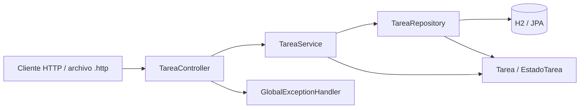
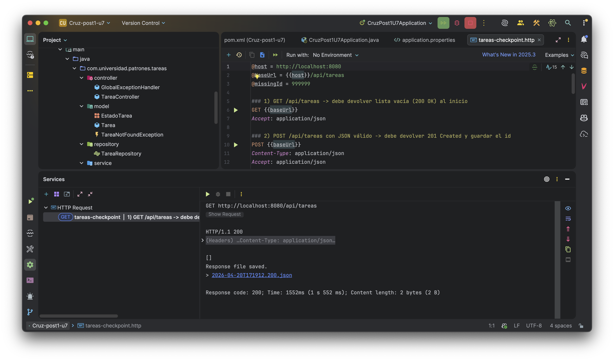
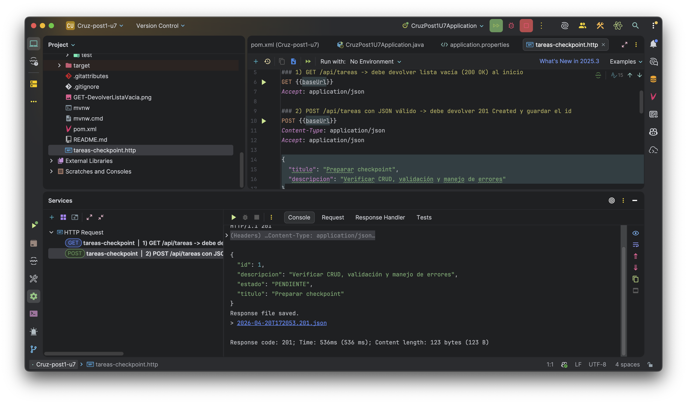
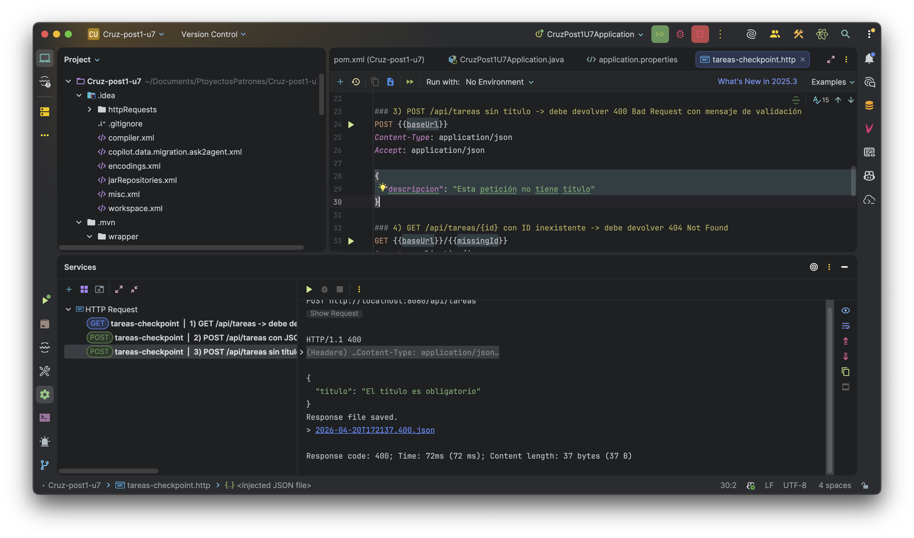
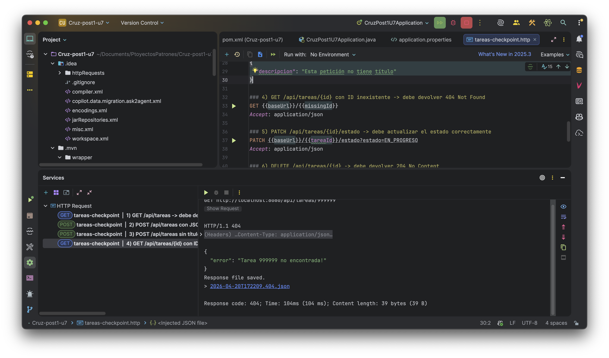
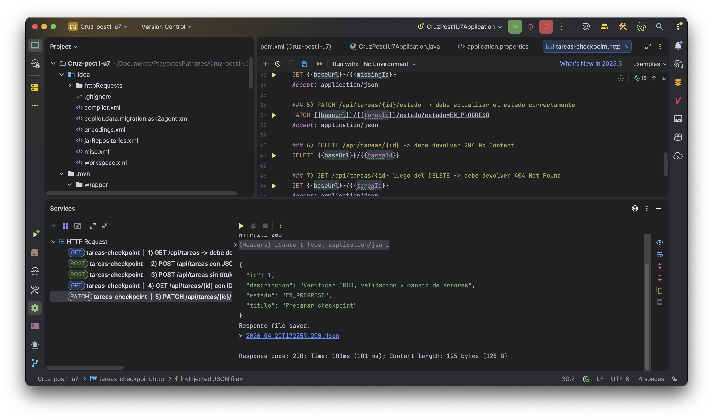
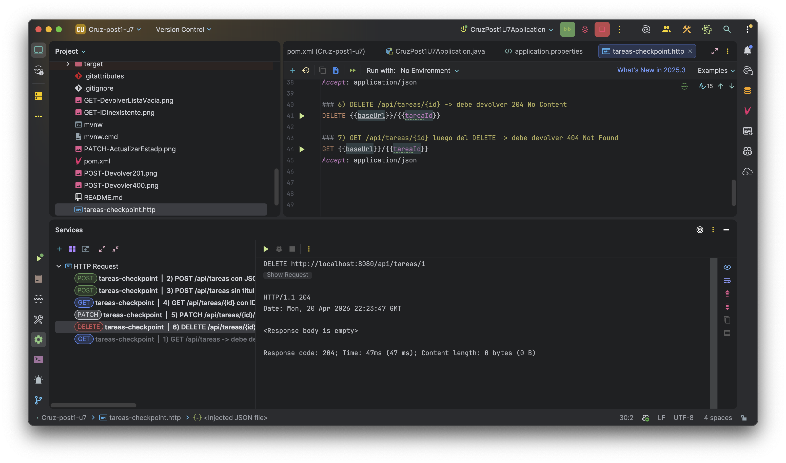
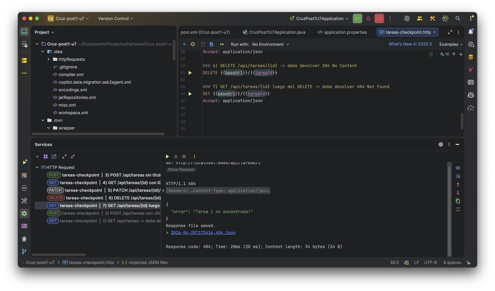

# Cruz-post1-u7

Aplicación Spring Boot para gestión de tareas con arquitectura por capas, persistencia con JPA/H2 y validación de entrada.

## Tabla de contenidos

- [Descripción](#descripción)
- [Arquitectura implementada](#arquitectura-implementada)
- [Endpoints principales](#endpoints-principales)
- [Capturas de pantalla del archivo `.http`](#capturas-de-pantalla-del-archivo-http)
- [Instrucciones de ejecución](#instrucciones-de-ejecución)
- [Notas de validación y errores](#notas-de-validación-y-errores)

## Descripción

Este proyecto expone una API REST para administrar tareas con las operaciones básicas de consulta, creación, actualización de estado y eliminación.

La aplicación usa:

- **Spring Boot** para la capa web.
- **Spring Web MVC** para los controladores REST.
- **Spring Data JPA** para persistencia.
- **H2** como base de datos embebida.
- **Jakarta Validation** para validar el campo `titulo`.

## Arquitectura implementada

La solución sigue una separación clara por capas:

- **Controller**: recibe solicitudes HTTP y delega el trabajo.
- **Service**: contiene la lógica de negocio.
- **Repository**: accede a la persistencia con JPA.
- **Model/Entity**: representa el dominio (`Tarea`, `EstadoTarea`).
- **Advice global**: centraliza el manejo de excepciones y validaciones.

### Diagrama de capas / puertos



### Vista conceptual por responsabilidades

```text
[Cliente HTTP]
      |
      v
[TareaController]  --> expone endpoints REST
      |
      v
[TareaService]     --> reglas de negocio
      |
      v
[TareaRepository]  --> persistencia JPA
      |
      v
[Base de datos H2]
```

## Endpoints principales

| Método | Endpoint | Descripción | Respuesta esperada |
|---|---|---|---|
| GET | `/api/tareas` | Lista todas las tareas | `200 OK` |
| GET | `/api/tareas/{id}` | Busca una tarea por id | `200 OK` / `404 Not Found` |
| POST | `/api/tareas` | Crea una nueva tarea | `201 Created` / `400 Bad Request` |
| PATCH | `/api/tareas/{id}/estado?estado=EN_PROGRESO` | Actualiza el estado de la tarea | `200 OK` |
| DELETE | `/api/tareas/{id}` | Elimina una tarea | `204 No Content` / `404 Not Found` |

## Capturas de pantalla del archivo `.http`

Las evidencias visuales se encuentran en la raíz del proyecto y se muestran a continuación.

### 1) Lista inicial vacía



### 2) Creación de tarea válida



### 3) Validación sin título



### 4) Consulta por id inexistente



### 5) Cambio de estado



### 6) Eliminación de tarea



### 7) Consulta posterior al DELETE




## Instrucciones de ejecución

### Requisitos previos

- **Java 17**
- **Maven Wrapper** incluido en el proyecto
- IDE con soporte para Spring Boot o terminal de Windows

### Ejecutar la aplicación

En Windows PowerShell, desde la raíz del proyecto:

```powershell
.\mvnw.cmd spring-boot:run
```

La aplicación queda disponible en:

```text
http://localhost:8080
```

### Ejecutar pruebas

```powershell
.\mvnw.cmd test
```

### Probar el endpoint manualmente

Puedes usar el archivo `tareas-checkpoint.http` desde IntelliJ IDEA o cualquier cliente compatible con peticiones `.http`.

## Notas de validación y errores

- El campo `titulo` es obligatorio y se valida con `@NotBlank(message = "El título es obligatorio")`.
- Cuando falta el título, la API responde `400 Bad Request` con un JSON de error.
- Cuando un id no existe, se lanza `TareaNotFoundException` y el `GlobalExceptionHandler` responde `404 Not Found`.
- Al crear una tarea, el estado inicial se fuerza a `PENDIENTE`.
- El `PATCH` de estado recibe el valor por query param, por ejemplo: `?estado=EN_PROGRESO`.
- Los logs deberían respetar responsabilidades por capa:
  - **Controller**: entrada HTTP
  - **Service**: negocio
  - **Repository**: persistencia

## Estructura resumida del proyecto

```text
src/main/java/com/universidad/patrones/tareas/
├── controller/
│   ├── GlobalExceptionHandler.java
│   └── TareaController.java
├── model/
│   ├── EstadoTarea.java
│   ├── Tarea.java
│   └── TareaNotFoundException.java
├── repository/
│   └── TareaRepository.java
└── service/
    └── TareaService.java
```

## Flujo recomendado de verificación

1. Ejecutar la aplicación.
2. Abrir `tareas-checkpoint.http`.
3. Ejecutar en orden:
   - `GET /api/tareas`
   - `POST /api/tareas`
   - `POST /api/tareas` sin título
   - `GET /api/tareas/{id}` inexistente
   - `PATCH /api/tareas/{id}/estado`
   - `DELETE /api/tareas/{id}`
   - `GET /api/tareas/{id}` después del delete
4. Capturar cada respuesta y guardarla en `docs/screenshots/`.

## Comentario final

Este proyecto prioriza una arquitectura simple, clara y verificable, con separación de responsabilidades y manejo centralizado de errores para facilitar el mantenimiento y las pruebas.


